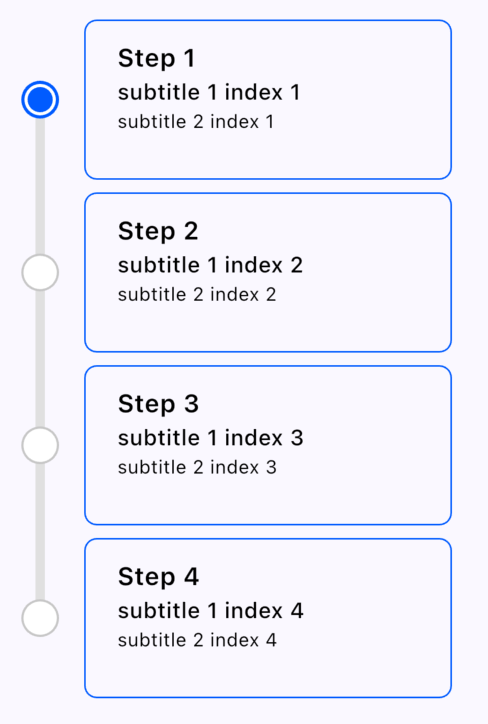
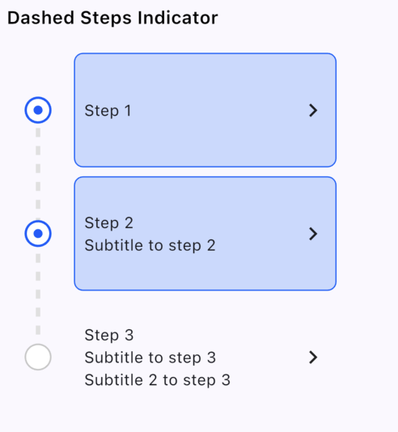
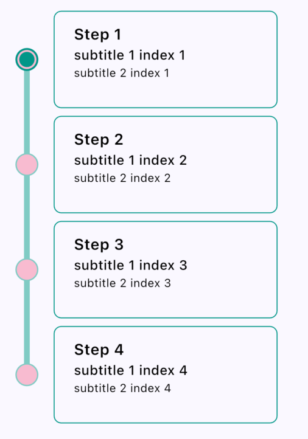
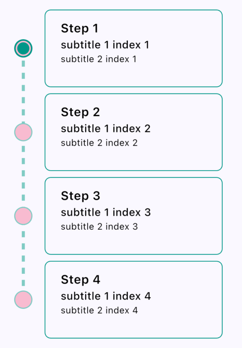

# Steps Indicator Widget

A Flutter package for customizable steps indicators, perfect for visualizing multi-step processes in your app.

## Features

- **Default Steps Indicator**: Simple and clean indicator design.
- **Dashed Steps Indicator**: Stylish dashed lines for a modern look.
- **Customizable Colors**: Easily set custom indicator, background, and border colors.
- **Flexible Layout**: Supports dynamic steps and current step customization.

## Installation

Add the package to your `pubspec.yaml` file:

```yaml
dependencies:
  steps_indicator: ^0.0.1
```

Then run:

```bash
flutter pub get
```

## Usage

Here is an example of how to use the `StepsIndicatorWidget`:

```dart
dartColumn(
  crossAxisAlignment: CrossAxisAlignment.start,
  children: [
    Text(
      'Default Steps Indicator',
      style: TextStyle(
        fontSize: 16,
        fontWeight: FontWeight.w600,
        color: Colors.black,
      ),
    ),
    StepsIndicatorWidget(
      steps: steps,
      currentStep: currentStep,
    ),
    SizedBox(height: 16),
    Text(
      'Dashed Steps Indicator',
      style: TextStyle(
        fontSize: 16,
        fontWeight: FontWeight.w600,
        color: Colors.black,
      ),
    ),
    StepsIndicatorWidget(
      steps: steps,
      currentStep: currentStep,
      lineType: LineType.dashed,
    ),
    SizedBox(height: 16),
    Text(
      'Default Steps Indicator with Custom Color',
      style: TextStyle(
        fontSize: 16,
        fontWeight: FontWeight.w600,
        color: Colors.black,
      ),
    ),
    StepsIndicatorWidget(
      steps: steps,
      currentStep: currentStep,
      indicatorColor: Colors.teal,
      backgroundColor: Colors.pink.shade100,
      borderColor: Colors.teal.shade200,
    ),
    SizedBox(height: 16),
    Text(
      'Dashed Steps Indicator with Custom Color',
      style: TextStyle(
        fontSize: 16,
        fontWeight: FontWeight.w600,
        color: Colors.black,
      ),
    ),
    StepsIndicatorWidget(
      steps: steps,
      currentStep: currentStep,
      indicatorColor: Colors.teal,
      backgroundColor: Colors.pink.shade100,
      borderColor: Colors.teal.shade200,
      lineType: LineType.dashed,
    ),
  ],
)
```

## Examples

### Default Steps Indicator:



### Dashed Steps Indicator:



### Default Steps Indicator with Custom Colors:



### Dashed Steps Indicator with Custom Colors:


## Customization

### Properties
- **steps**: Total number of steps in the indicator.
- **currentStep**: The currently active step.
- **indicatorColor**: The color of the step indicators.
- **backgroundColor**: The background color of the steps.
- **borderColor**: The border color for the step indicators.
- **lineType**: `LineType.solid` or `LineType.dashed`.

## Example App

Check out the example directory for a complete [EXAMPLE](example) app.

## License
This project is licensed under the MIT License - see the [LICENSE](LICENSE) file for details.

