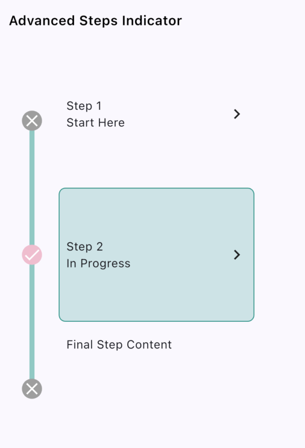

# Vertical Steps Indicator Widget

A Flutter package for customizable steps indicators, perfect for visualizing multi-step processes in your app.

## Features

- **Default Steps Indicator**: Simple and clean indicator design.
- **Dashed Steps Indicator**: Stylish dashed lines for a modern look.
- **Customizable Colors**: Easily set custom indicator, background, and border colors.
- **Flexible Layout**: Supports dynamic steps and current step customization.

## Installation

Add the package to your `pubspec.yaml` file:

```yaml
dependencies:
  vertical_steps_indicator: ^0.0.1
```

Then run:

```bash
flutter pub get
```

## Usage

Here is an example of how to use the `StepsIndicatorWidget`:

### Basic Example


```dart
StepsIndicatorWidget(
  steps: [
    StepItemModel(title: Text('Step 1')),
    StepItemModel(title: Text('Step 2')),
    StepItemModel(contents: Text('Custom Step Content')),
  ],
  currentStep: 1,
)
```

### Dashed Line Example


```dart
StepsIndicatorWidget(
  steps: [
    StepItemModel(title: Text('Step 1')),
    StepItemModel(
        title: Text('Step 2'),
        subtitle1: Text('Subtitle to step 2')),
    StepItemModel(
        title: Text('Step 3'),
        subtitle1: Text('Subtitle to step 3'),
        subtitle2: Text('Subtitle 2 to step 3')),
  ],
  currentStep: 1,
  lineType: LineType.dashed,
  indicatorType: IndicatorType.previous,
),
```

### Advanced Example



```dart
StepsIndicatorWidget(
  steps: [
    StepItemModel(title: Text('Step 1'), subtitle1: Text('Start Here')),
    StepItemModel(title: Text('Step 2'), subtitle1: Text('In Progress')),
    StepItemModel(contents: Text('Final Step Content')),
  ],
  currentStep: 2,
  indicatorType: IndicatorType.onlyCurrent,
  lineType: LineType.dashed,
  indicatorColor: Colors.teal,
  backgroundColor: Colors.pink.shade100,
  borderColor: Colors.teal.shade200,
  selectedIndicator: Icon(Icons.check_circle, color: Colors.green),
  normalIndicator: Icon(Icons.circle_outlined, color: Colors.grey),
)
```

## Parameters

### StepIndicatorWidget

|**Parameter**	|**Type**	|**Description**|
|:-----------|:-----------|:-----------|
|**steps**	|List\<StepItemModel\>	|Defines the steps with optional title, subtitle, or custom content.|
|**currentStep**	|int	|The current step index.|
|**indicatorType**	|IndicatorType	|Specifies the indicator type: **onlyCurrent** will only highlight current step or **previous** which will highlight current and all previous steps.|
|**stepItemHeight**	|double?	|Custom height for each step item.|
|**indicatorColor**	|Color?	|The color for the step indicator.|
|**borderColor**	|Color?	|The border color for the step indicator.|
|**backgroundColor**	|Color?	|The background color for the step indicator.|
|**lineType**	|LineType?	|Specifies the line style: normal or dashed.|
|**selectedIndicator**	|Widget?	|Widget to override the current step indicator.|
|**normalIndicator**	|Widget?	|Widget to override the normal step indicator.|

### StepItemModel
|**Property**	|**Type**	|**Description**|
|:-----------|:-----------|:-----------|
|**title**	|Widget?	|Title widget for the step item.|
|**subtitle1**	|Widget?	|First subtitle widget for the step item.|
|**subtitle2**	|Widget?	|Second subtitle widget for the step item.|
|**contents**	|Widget?	|Custom content for the step item.|

**Note**: Either title or contents must be provided; otherwise, an error will be thrown.

## Enums

### LineType

- normal
- dashed

### IndicatorType

- onlyCurrent
- previous

## Example App

Check out the example directory for a complete [EXAMPLE](example) app.

## License
This project is licensed under the MIT License - see the [LICENSE](LICENSE) file for details.

